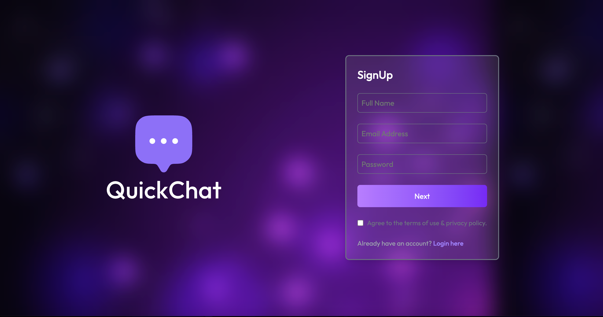
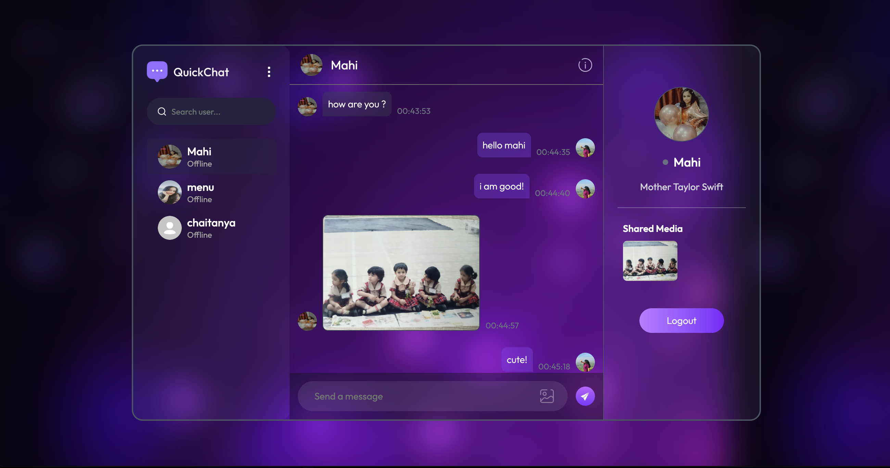
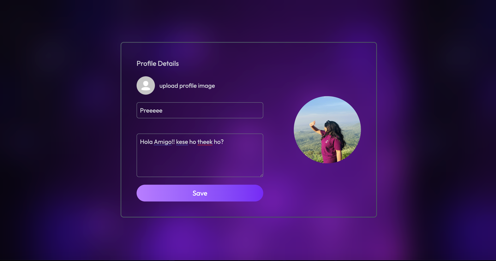

<div align="center">

# 💬 Aurachat  
### Real-Time Chat Application built with MERN + Socket.io


</div>

---

## 🌐 Overview

**Aurachat** is a modern **real-time chat platform** built with the **MERN stack** and **Socket.io**.  
It enables seamless 1:1 messaging, file and media sharing, live online indicators, and user profile management — all wrapped in a clean and responsive UI.

---

## 🚀 Features

- 🔐 **Secure Authentication** — User login/signup with JWT  
- 💬 **Instant Messaging** — Real-time chats powered by Socket.io  
- 📁 **File & Media Sharing** — Send images, videos, and documents instantly  
- 👤 **Profile Management** — Update name, bio, and profile picture  
- 🟢 **Online Status** — See who’s currently active  
- 📩 **Unread Message Count** — Easily track unseen messages  
- ☁️ **Cloudinary Integration** — For optimized image and media uploads  
- 🎨 **Responsive UI** — Built with Tailwind CSS and Vite for smooth performance  

---

## 🧩 Tech Stack

| Layer | Technologies |
|--------|---------------|
| **Frontend** | React, Vite, Tailwind CSS |
| **Backend** | Node.js, Express.js |
| **Database** | MongoDB (Mongoose) |
| **Real-time** | Socket.io |
| **Media Uploads** | Cloudinary |

---
## 📸 Screenshots

### 🔐 Login Page


### 💬 Chat Interface


### 👤 Profile Page


## ⚙️ Installation

### 1️⃣ Clone the Repository
```bash
git clone https://github.com/priyanshisoni14/AuraChat.git
cd AuraChat
